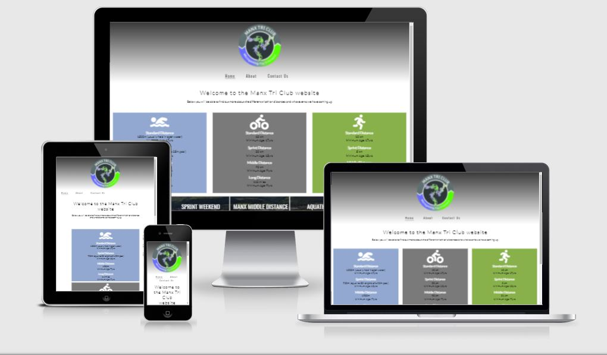
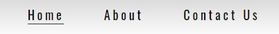
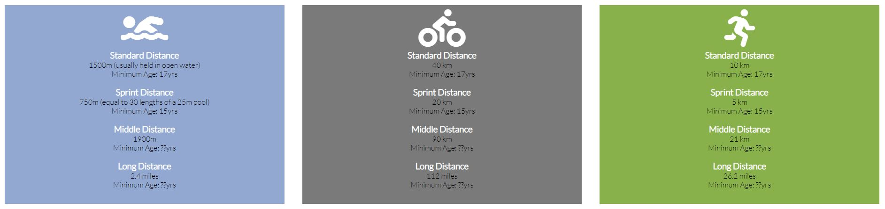
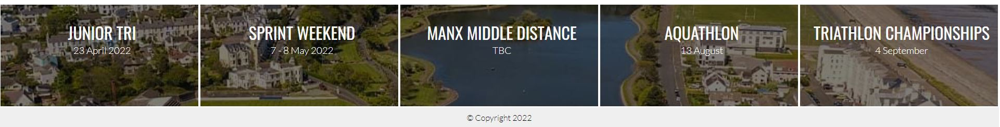
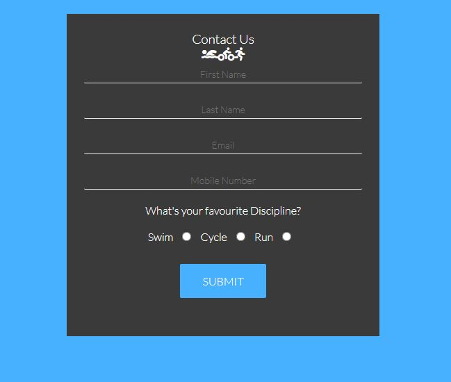

Welcome to my first Code Institute diploma project.

I have left a few of the important commands in here to help remind me whilst working through the project.

# Introduction
For my first project I have decided to re-design an existing website for the Manx Tri Club.

## Overview
The website will be a place where existing and prospective club members can come and keep up to date with upcoming events, training sessions and social activities.  They will also be able to complete a contact form to recieve further information on the club.

---

---

# TABLE OF CONTENT
1. [USER STORY](#user-story)
2. [STRUCTURE](#structure)
3. [DESIGN](#design)
4. [TECHNOLOGIES USED](#technologies-used)
5. [TESTING](#testing)
6. [BUGS AND PROBLEMS](#bugs-and-problems)
7. [FEATURES](#features)
8. [FUTURE FEATURES](#features-I-would-like-to-implement)
9. [DEPLOYMENT](#deployment)
10. [CREDITS AND ACKNOWLEDGEMENT](#credits-and-acknowledgement)

# USER STORY
### Visitor to the website
* I want to have a good idea of what the website is about from the home page.
* I want easy navigation throughout the website.
* I want to be able to obtain further information about the website and its purpose.
* I want to read more about the individual disciplines of triathlon.
* I want to find out what events are being run.
* I want to find out about any training sessions or social activities are being held.

# STRUCTURE
## HEADER

## NAVIGATION

## MAIN CONTENT

## DISCIPLINE DETAILS

## EVENT DATES

## CONTACT FORM

# DESIGN
## Typography
I chose the following fonts from [Google Fonts](https://fonts.google.com/) as they are modern, clean and easy to read.

[Oswald Regular 400](https://fonts.google.com/specimen/Oswald)

[Lato Light 300](https://fonts.google.com/specimen/Lato) 

## Color Palettes
I kept the colors limited so as to avoid eye strain for the user.

  

&nbsp;

Typography colors throughout the site were kept to;

 

&nbsp;

## Icons/Images
#### Icons used throughout the project are from [FontAwesome](https://fontawesome.com/)

# TECHNOLOGIES USED
## HTML
### Each page was built using HTML5.

## CSS
### The styling, layout and media queries were done using CSS.

## Development Environment
* [Gitpod](https://gitpod.io): The online IDE I used to write my code in.
* [Github](https://github.com): My repository is housed here.
* I used Google Chrome on a Windows PC for all my work.

# TESTING

## Passed my html codes through [W3C Markup Validator](https://validator.w3.org/)

* Index/Home page _index.html_

    &check; Document checking completed with no errors or warnings to show.

* About page _about.html_

    &check; Document checking completed with no errors or warnings to show.

* Contact page _contact.html_

    &check; Document checking completed with no errors or warnings to show.

## Passed my CSS codes through [W3C CSS Validator](https://validator.w3.org/)

* style.css

    &check; Document checking completed with no errors or warnings to show.

## Checked responsiveness through [ami.responsivedesign.is website](http://ami.responsivedesign.is/)

# BUGS AND PROBLEMS

# FEATURES

# FUTURE FEATURES
## Future feature and development

# DEPLOYMENT

# CREDITS AND ACKNOWLEDGEMENT

A huge thank you to my [Code Institue](https://codeinstitute.net/global/) mentor Brian O'Hare for his guidance and support.

My business partner Damian for his support and belief in me.

Inspiration for the project was taken from the Code Institure's "Love Running" project.

[Manx Tri Club](https://manxtriclub.com/): Some of the content (contact details, event dates, membership details etc.) for the project were extracted from the existing Manx Tri Club website.

[Header Color Gradient](https://www.w3schools.com/colors/colors_gradient.asp): Header gradient created using the W3S webite.

---

## Gitpod Reminders

To run a frontend (HTML, CSS, Javascript only) application in Gitpod, in the terminal, type:

`python3 -m http.server`

A blue button should appear to click: _Make Public_,

Another blue button should appear to click: _Open Browser_.

To run a backend Python file, type `python3 app.py`, if your Python file is named `app.py` of course.

A blue button should appear to click: _Make Public_,

Another blue button should appear to click: _Open Browser_.

In Gitpod you have superuser security privileges by default. Therefore you do not need to use the `sudo` (superuser do) command in the bash terminal in any of the lessons.

------

