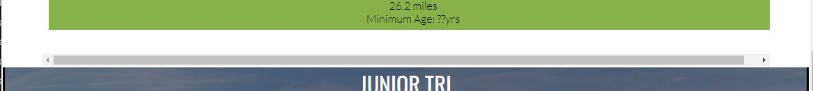
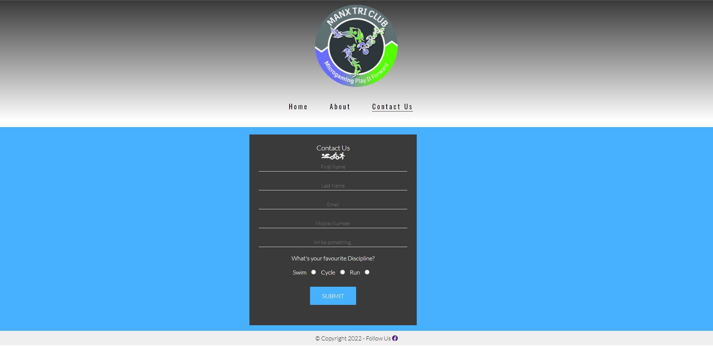

Welcome to my first Code Institute diploma project.

I have left a few of the important commands in here to help remind me whilst working through the project.

# Introduction
For my first project I have decided to re-design in part, an existing website for the Manx Tri Club.

## Overview
The website will be a place where existing and prospective club members can come and keep up to date with upcoming events, training sessions and social activities.  They will also be able to complete a contact form to recieve further information on the club.


### **Live Project can be viewed:** [Manx Tri Club](https://garycooper-pm.github.io/gc_first-project/)

### **The repository can be found here:** [Manx Tri Club Source Code](https://github.com/GaryCooper-pm/gc_first-project)

---


---

# TABLE OF CONTENT
1. [USER STORY](#user-story)
2. [STRUCTURE](#structure)
3. [DESIGN](#design)
4. [TECHNOLOGIES USED](#technologies-used)
5. [TESTING](#testing)
6. [BUGS AND PROBLEMS](#bugs-and-problems)
7. [FEATURES](#features)
8. [FUTURE FEATURES](#features-I-would-like-to-implement)
9. [DEPLOYMENT](#deployment)
10. [CREDITS AND ACKNOWLEDGEMENT](#credits-and-acknowledgement)

# USER STORY
### Visitor to the website
* I want to have a good idea of what the website is about from the home page.
* I want easy navigation throughout the website.
* I want to be able to obtain further information about the website and its purpose.
* I want to read more about the individual disciplines of triathlon.
* I want to find out what events are being run.
* I want to find out about any training sessions or social activities are being held.


# STRUCTURE
## HEADER


## NAVIGATION


## MAIN CONTENT


## DISCIPLINE DETAILS


## EVENT DATES


## CONTACT FORM


# DESIGN
## Typography
I chose the following fonts from [Google Fonts](https://fonts.google.com/) as they are modern, clean and easy to read.


[Oswald Regular 400](https://fonts.google.com/specimen/Oswald)


[Lato Light 300](https://fonts.google.com/specimen/Lato) 

## Color Palettes
I kept the colors limited so as to avoid eye strain for the user.


  
<p>&nbsp;</p>


Typography colors throughout the site were kept to;

 
<p>&nbsp;</p>


## Icons/Images
#### Icons used throughout the project are from [FontAwesome](https://fontawesome.com/)


# TECHNOLOGIES USED
## HTML
### Each page was built using HTML5.

## CSS
### The styling, layout and media queries were done using CSS.

## Development Environment
* [Gitpod](https://gitpod.io): The online IDE I used to write my code in.
* [Github](https://github.com): My repository is housed here.
* I used Google Chrome on a Windows PC for all my work.


# TESTING

## Passed my html codes through [W3C Markup Validator](https://validator.w3.org/)

* Index/Home page _index.html_

    &cross; Document checking completed with errors and only one warning

    **Warning**

    'Empty Heading' from line 36, column 13; to line 36, column 16;
    ```bash
    <h3><i class="fas fa-swimmer"></i><i class="fas fa-biking"></i><i class="fas fa-running"></i></h3>
    ```
    **Errors**

    Error 'Start tag h3 seen in table' from line 38, column 17; to line 39, column 37
    ```bash
    <tr>
        <h3 class="table-h3">Sprint Distance</h3>    
    ```

    Fatal Error: Cannot recover after last error. Any further errors will be ignored.
    From line 38, column 17; to line 39, column 37

* About page _about.html_

    &check; Document checking completed with no errors or warnings to show.

* Contact page _contact.html_

    &check; Document checking completed with no errors and only one warning
    
    **Warning**
    
    'Empty Heading' from line 33, column 9; to line 33, column 12;
    ```bash
    <h2><i class="fas fa-swimmer"></i></h2>
    ```


## Passed my CSS codes through [W3C CSS Validator](https://validator.w3.org/)

* style.css

    &check; Document checking completed with no errors or warnings to show.


## Checked responsiveness through [ami.responsivedesign.is website](http://ami.responsivedesign.is/)

# BUGS AND PROBLEMS

## There is an issue with the Discipline section of the index.html when re-sizing the browser whereby a horizontal scroll bar appears.



## There is an issue where the Contact Form is not centering on the contact.html.


# FEATURES

## Header
* Club logo centered on the page

## Navigation
* A clean simple text navigation menu, centered on the page with styling to show active page and mouse-over state changes was used.


## Home page
* A brief overview of the different triathlon distances split by discipline
* A list of events being hosted by the club


## About page
* Brief details about the club
* Details of the different membership options and prices
* Details of the benefits of membership


## Contact page
* Simple styled contact form with mandatory fields and optional 'Favourite discipline' radio buttons


# FUTURE FEATURES
## Future feature and development
* I would like to expand on the content of the site with input and content provided by the club committee members
* I would like to integrate an event entry form
* I would like to implement a members only page where they can download course maps


# DEPLOYMENT

## Github
### Project Setup:
    * Create new repository in github
    * Select Code Institute Full Template
    * Name and create the repository
    * On the repository page, CLICK the green GITPOD button to launch gitpod
    * Commands used for the project;
        * `git add .` to add files to stage
        * `git commit -m "commit message"`
        * `git push` to puch changes through to main in github
<p>&nbsp;</p>

## Gitpod
### Project Setup:
    * Created basic file structure
        * assets folder
            * css folder (sub-folder of assets)
                * style.css
            * images folder (sub-folder of assets)
            * README_images folder (sub-folder of assets)
        * index.html
        * about.html
        * contact.html
        * README.md


# CREDITS AND ACKNOWLEDGEMENT

A huge thank you to my [Code Institue](https://codeinstitute.net/global/) mentor Brian O'Hare for his guidance and support.

My wife Clare and daughters Grace and Emily for their patience and allowing me to work evenings and weekends on my project.

My business partner Damian for his support and belief in me.

[Brad Traversy](https://gist.github.com/bradtraversy) for his invaluable [Markdown Cheat Sheet](https://gist.github.com/bradtraversy/547a7bbf35ffba1561706e161a50b05a)

Inspiration and snippets of CSS for the project were taken from the Code Institure's [Love Running](https://garycooper-pm.github.io/love-running/index.html) project.

```bash
#events {
    background-image: url('../images/mooragh_park_ramsey_isle_of_man.jpg');
    background-size: cover;
    background-position: center;
    width: 100%;
    overflow: hidden;
}

#events div {
    color: #fafafa;
    background-color: rgba(0,0,0, .5);
    width: 20%;
    height: 200px;
    float: left;
    padding: 30px 0 0 10px;
    text-align: center;
    border: 2px solid white;
    box-sizing: border-box;
}
```

[Manx Tri Club](https://manxtriclub.com/): Some of the content (contact details, event dates, membership details etc.) for the project were extracted from the existing Manx Tri Club website.

[Header Color Gradient](https://www.w3schools.com/colors/colors_gradient.asp): Header gradient created using the W3S webite.

---