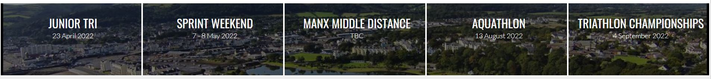
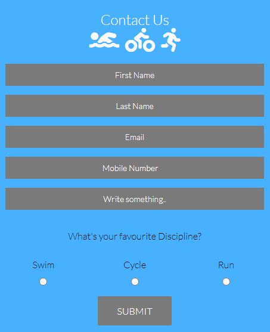
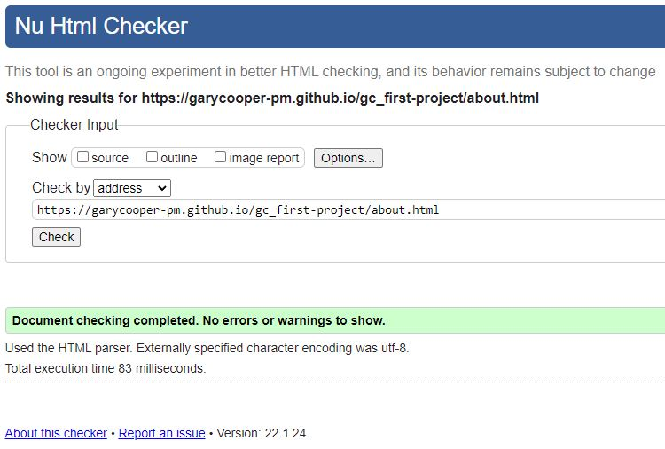
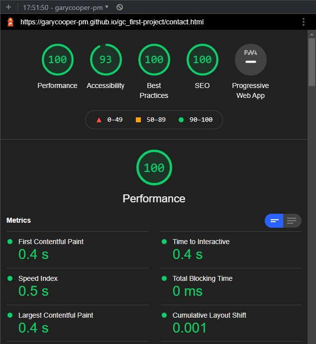

Welcome to my first Code Institute diploma project.

I have left a few of the important commands in here to help remind me whilst working through the project.

# Introduction and Overview
For my first project I have decided to re-design in part, an existing website for the Manx Tri Club.

The website will be a place where existing and prospective club members can come and keep up to date with upcoming events, training sessions and social activities.  They will also be able to complete a contact form to recieve further information on the club.


### **Live Project can be viewed:** [Manx Tri Club](https://garycooper-pm.github.io/gc_first-project/)

### **The repository can be found here:** [Manx Tri Club Source Code](https://github.com/GaryCooper-pm/gc_first-project)

---


---

# TABLE OF CONTENT
1. [USER STORY](#user-story)
2. [STRUCTURE](#structure)
3. [DESIGN](#design)
4. [TECHNOLOGIES USED](#technologies-used)
5. [TESTING](#testing)
6. [BUGS AND PROBLEMS](#bugs-and-problems)
7. [FUTURE FEATURES](#features-I-would-like-to-implement)
8. [DEPLOYMENT](#deployment)
9. [CREDITS AND ACKNOWLEDGEMENT](#credits-and-acknowledgement)

# USER STORY
### Visitor to the website
* I want to have a good idea of what the website is about from the home page.
* I want easy navigation throughout the website.
* I want to be able to obtain further information about the website and its purpose.
* I want to read more about the individual disciplines of triathlon.
* I want to find out what events are being run.
* I want to find out about any training sessions or social activities are being held.


# STRUCTURE
## Header
* A clean and simple header using a subtle gradient for style and contains the club logo centered on the page


## Navigation
* A clean simple text navigation menu, centered on the page with styling to show active page and mouse-over state changes was used.
* The styling for an active page is a simple underline.


## Main Index page content
* A brief welcome note and description of the website
* An overview of the different triathlon distances split by discipline
* A list of events being hosted by the club


## Footer
* A clean simple footer containing copyright and Social Media icon with link.


Discipline details
* The discipline details section consists of three columns each pertaining to a specific discipline of triathlon (swimming, cycling and running).
* Each discipline further details the different distances and minimum age.
    * The columns are styled through CSS to stack when the browser is re-sized.


Event details
* The event dates section displays the events across five columns over a background image.
    * The columns are styled through CSS to stack when the browser is re-sized.



### About page
* Brief details about the club
* Details of the different membership options and prices
* Details of the benefits of membership


### Contact page
* Simple styled contact form with mandatory fields and optional 'Favourite discipline' radio buttons
* The contact form is a dummy form for the purpose of this project and submits to the https://formdump.codeinstitute.net form dump.




# FUTURE FEATURES
* I would like to expand on the content of the site with input and content provided by the club committee members
* I would like to integrate an event entry form
* I would like to implement a members only page where they can download course maps

# DESIGN
### Typography
I chose the following fonts from [Google Fonts](https://fonts.google.com/) as they are modern, clean and easy to read.


[Oswald Regular 400](https://fonts.google.com/specimen/Oswald)


[Lato Light 300](https://fonts.google.com/specimen/Lato) 

### Color Palettes
I kept the colors limited so as to avoid eye strain for the user.


  
<p>&nbsp;</p>


Typography colors throughout the site were kept to;

 
<p>&nbsp;</p>


### Icons
Icons used throughout the project are from [FontAwesome](https://fontawesome.com/)


# TECHNOLOGIES USED
* HTML
    * Each page was built using HTML5.
* CSS
    * The styling, layout and media queries were done using CSS.
* Adobe Photoshop
    * The logo was edited to remove a white and blue background to create the png file used in the header.

## Development Environment
* [Gitpod](https://gitpod.io): The online IDE I used to write my code in.
* [Github](https://github.com): My repository is housed here.
* I used Google Chrome on a Windows PC for all my work.


# TESTING

### Passed my html codes through [W3C Markup Validator](https://validator.w3.org/)

* Index/Home page _index.html_

    &check; Document checking completed with no errors or warnings to show

[Index html code pass](https://validator.w3.org/nu/?doc=https%3A%2F%2Fgarycooper-pm.github.io%2Fgc_first-project%2Findex.html)


* About page _about.html_

    &check; Document checking completed with no errors or warnings to show

[About html code pass](https://validator.w3.org/nu/?doc=https%3A%2F%2Fgarycooper-pm.github.io%2Fgc_first-project%2Fabout.html)



* Contact page _contact.html_

    &check; Document checking completed with no errors or warnings to show

[Contact html code pass](https://validator.w3.org/nu/?doc=https%3A%2F%2Fgarycooper-pm.github.io%2Fgc_first-project%2Fcontact.html)


### Passed my CSS codes through JIGSAW [W3C CSS Validator](https://validator.w3.org/)

* style.css

    &check; Document checking completed with no errors or warnings to show

[Style css code pass](https://jigsaw.w3.org/css-validator/validator?uri=https%3A%2F%2Fgarycooper-pm.github.io%2Fgc_first-project%2Fassets%2Fcss%2Fstyle.css&profile=css3svg&usermedium=all&warning=1&vextwarning=&lang=en)


### Checked responsiveness through [ami.responsivedesign.is website](http://ami.responsivedesign.is/)


### Checked accessibility through [Lighthouse](https://developers.google.com/web/tools/lighthouse)

Index page


About page


Contact page




# BUGS AND PROBLEMS

There was an issue with the Discipline section of the index.html when re-sizing the browser a horizontal scroll bar would appear.


This was resolved by using flex in my media queries in the style.css

```bash
#content {
        margin: 0 auto;
        display: flex;
        flex-direction: column;
        justify-content: center;
        align-items: center;
    }
```

There was an issue where the Contact Form was not centering on the contact.html.


This was resolved by re-styling the entire form and by using flex in my style.css

```bash
.container {
    display: flex;
    min-height: 100vh;
    flex-direction: column;
    flex-grow: 2;
}

.form-section {
    display: flex;
    padding-top: 10px;
    justify-content: space-evenly;
    background-color: #47B0FF;
    height: 550px;
}
```

## PROGRAMS USED

* GITPOD
  * The IDE used to code this website
* GIT
  * For version control, commiting and pushing to github
* GITHUB
  * Used to store repositories, files and images pushed from gitpod
* CHROME Developer tools
  * For checking compatibilty, troubleshooting and editing code
* Am I Responsive
  * Used to test responsiveness of the website at different screen sizes
* FONTAWESOME
  * Used for the social media link icon in the footer of each page and triathlon icons on the discipline page and contact form


# DEPLOYMENT

## Github
### Project Setup:
    * Create new repository in github
    * Select Code Institute Full Template
    * Name and create the repository
    * On the repository page, CLICK the green GITPOD button to launch gitpod
    * Commands used for version control during the project;
        * `git add "example file name"` to add files to stage
        * `git commit -m "commit message"`
        * `git push` to puch changes through to main in github
<p>&nbsp;</p>

## Gitpod
### Project Setup:
    * Created basic file structure
        * assets folder
            * css folder (sub-folder of assets)
                * style.css
            * images folder (sub-folder of assets)
        * docs folder
            * images folder (sub-folder of docs for housing the README.md images)
        * index.html
        * about.html
        * contact.html
        * README.md


### This site was deployed using GitHub Pages with the following steps:

1. Click on the `Settings` icon at the top of page in the navigation bar
2. Scroll down until you see `Github Pages`
3. There will be a message box saying "Check it out here" Click on the link to take you to the next page
4. Here you will be greated with a form, Choose the repository `gc_first-project`
5. Choose the branch in the drop down box, in this case `MAIN`
6. Choose the directory in the next drop down box, in this case `Root`
7. Then click `Save`
8. It may take a few moments for the site to publish, but once live, the box at the top of the page with the site name will turn green and have a `Green` tick to the left of the link to the live site


# CREDITS AND ACKNOWLEDGEMENT

A huge thank you to my [Code Institue](https://codeinstitute.net/global/) mentor Brian O'Hare for his guidance and support.

My wife Clare and daughters Grace and Emily for their patience and allowing me to work evenings and weekends on my project.

My business partner Damian for his support and belief in me.

[Chris Williams](https://github.com/Chr15w1986) for taking the time to call me and talk through some of the issues I was having, thanks Chris, I owe you a case!

[Brad Traversy](https://gist.github.com/bradtraversy) for his invaluable [Markdown Cheat Sheet](https://gist.github.com/bradtraversy/547a7bbf35ffba1561706e161a50b05a)

Inspiration and snippets of CSS for the project were taken from the Code Institure's [Love Running](https://garycooper-pm.github.io/love-running/index.html) project.

```bash
#events {
    background-image: url('../images/mooragh_park_ramsey_isle_of_man.jpg');
    background-size: cover;
    background-position: center;
    width: 100%;
    overflow: hidden;
}

#events div {
    color: #fafafa;
    background-color: rgba(0,0,0, .5);
    width: 20%;
    height: 200px;
    float: left;
    padding: 30px 0 0 10px;
    text-align: center;
    border: 2px solid white;
    box-sizing: border-box;
}
```

[Manx Tri Club](https://manxtriclub.com/): Some of the content (Logo, event dates, membership details) for the project were extracted from the existing Manx Tri Club website and Facebook page.

[Header Color Gradient](https://www.w3schools.com/colors/colors_gradient.asp): Header gradient created using the W3C webite.

[Arial Photograph](http://www.island-images.co.uk/Aerial/Aerial%202015/150919102407.html): Event Details picture background courtesy of Jon Wornham.

---